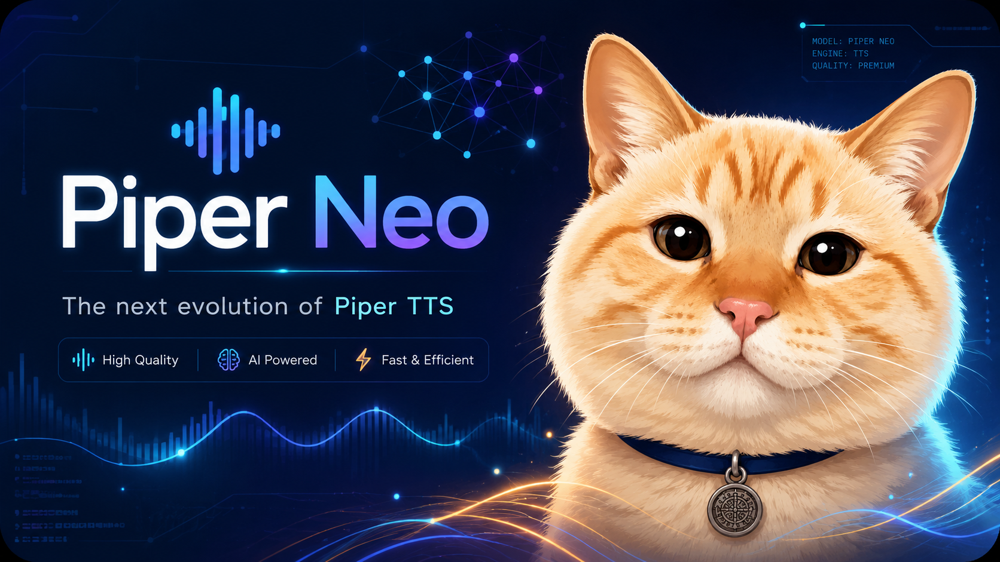

<p align="center">
  
</p>

# Piper Neo

Piper Neo is the next evolution of Piper TTS: a more optimized, safer and production-friendly build focused on long texts, Latin American Spanish, local/API usage and controlled resource management.

This fork keeps the spirit of Piper, but adds practical features for servers, dashboards and automation systems that need predictable CPU, RAM and disk behavior.

## What is new in Piper Neo

- Smart text chunking that avoids breaking words, questions, exclamations and UTF-8 characters.
- Stable Latin American Spanish input with accents, `ñ`, `¿?`, `¡!` and special characters.
- Direct text input with `--text`.
- Text file input with `--input_file` / `--input-file`.
- Progressive WAV writing so long inputs do not require a huge final audio buffer in RAM.
- Local HTTP API server with `--server`.
- Model directory support with `--models`.
- Per-request model selection using the `model` JSON field.
- Optional API token from `--api-token`, environment variables or `.env`.
- Auto resource configuration when starting with only `--server --models models`.
- Manual overrides for CPU threads, concurrent jobs, model replicas, queue size and chunk workers.
- Fair chunk scheduler so several clients can progress at the same time instead of one long text monopolizing the engine.
- Controlled temporary disk usage with `--max-temp-bytes`.
- Automatic cleanup of temporary synthesis files on server start.
- Automatic deletion of generated API audios after 1 hour by default.
- Metadata cache for `/api/v1/models` with `--models-refresh-seconds`.
- Model metadata from `.onnx.json` without exposing large `phoneme_id_map` or embedded base64 images in list responses.
- Dedicated model image endpoint: `/api/v1/models/{model}/image`.
- Safer API responses that do not expose internal absolute server paths.
- Conversion logs with timestamp, model load time, total chunks, generated audio duration, inference duration, wall-clock duration and final bytes.
- Included Coqui TTS `TTS/bin/resample.py` helper for Piper training workflows.

## Quick CLI usage

Generate from direct text:

```bash
./piper --model models/es_MX-voice.onnx \
  --text "Hola México, ¿cómo estás?" \
  --output_file saludo.wav
```

Generate from a UTF-8 text file:

```bash
./piper --model models/es_MX-voice.onnx \
  --input_file texto.txt \
  --output_file salida.wav \
  --cpu-threads 2
```

## Quick API usage

Start the server with automatic resource tuning:

```bash
./piper --server --models models
```

Recommended production-style example:

```bash
./piper --server \
  --models models \
  --host 127.0.0.1 \
  --port 8080 \
  --cpu-profile auto \
  --output-retention-seconds 3600
```

Generate TTS:

```bash
curl -X POST http://127.0.0.1:8080/api/v1/tts \
  -H "Content-Type: application/json" \
  -d '{"model":"es_MX-voice.onnx","text":"Hola México, ¿cómo estás? ñ á é í ó ú"}'
```

The API generates a safe file name automatically. The `output_file` parameter is intentionally not supported in the HTTP API.

Download the generated audio from the `url` returned by the API:

```bash
curl http://127.0.0.1:8080/api/v1/files/tts_xxx.wav --output audio.wav
```

Generated API WAV files are compact PCM WAV files with no extra metadata/base64 wrapping. They are served as binary files and are deleted automatically after the retention period. The default retention is 3600 seconds.

## API endpoints

- `GET /api/health`
- `GET /api/v1/status`
- `GET /api/v1/metrics`
- `GET /api/v1/models`
- `GET /api/v1/models?include=metadata`
- `GET /api/v1/models?include=technical`
- `GET /api/v1/models/{model}/image`
- `POST /api/v1/tts`
- `GET /api/v1/files/{file}`

Responses follow a simple standard shape:

```json
{
  "success": true,
  "message": "Audio generado exitosamente.",
  "data": {}
}
```

Errors use:

```json
{
  "success": false,
  "error": "invalid_request",
  "message": "Descripción del error."
}
```

## Optional API token

If no token is configured, the server does not require authentication.

Configure a token with one of these options:

```bash
./piper --server --models models --api-token "secret"
```

```env
PIPER_API_TOKEN=secret
```

Request with:

```bash
curl http://127.0.0.1:8080/api/v1/status \
  -H "Authorization: Bearer secret"
```

## Resource controls

Auto mode is enabled by default in server mode. It detects CPU affinity, Docker/cgroup CPU quota and memory limit before choosing workers, jobs and model replicas. These flags can override it:

```bash
--cpu-profile auto|eco|balanced|fast|max
--cpu-threads NUM|auto
--max-concurrent-jobs NUM
--chunk-workers NUM
--max-model-replicas NUM
--queue-size NUM
--queue-timeout-seconds NUM
--max-input-bytes NUM
--max-text-chunk-bytes NUM
--max-temp-bytes NUM  # 0 = unlimited; if omitted, it is computed automatically
--output-retention-seconds NUM
--models-refresh-seconds NUM
```

The server avoids collapse by splitting text into chunks, writing temporary RAW chunk files, assembling the final WAV at the end, tuning ONNX CPU threads/workers from available hardware, limiting replicas by memory and cleaning generated files automatically.

## Training helper

The Coqui TTS resampling helper is included at:

```text
TTS/bin/resample.py
```

Example:

```bash
python TTS/bin/resample.py \
  --input_dir dataset_raw \
  --output_sr 22050 \
  --output_dir dataset_22050 \
  --file_ext wav \
  --n_jobs 8
```

## Documentation

- `README.es.md`: Spanish documentation.
- `docs/api-server.md`: full HTTP API documentation.
- `docs/new-piper-usage.md`: CLI usage, text files and smart chunking.
- `docs/resource-management-plan.md`: resource management notes.

## Original project

Development has moved: https://github.com/OHF-Voice/piper1-gpl

## Piper Neo model packages (`.neo`)

Piper Neo also supports a new single-file voice package format: `.neo`.

A `.neo` file contains:

- the ONNX model payload
- the Piper JSON voice config metadata
- modelcard information
- optional image/cover art
- speaker and inference metadata

Internal sections are compressed with zstd. This is lossless: model weights are preserved, so audio quality is not reduced. The benefit is smaller distribution files and fewer deployment mistakes because the model and config travel together.

Classic Piper voices remain supported:

```text
voice.onnx
voice.onnx.json
```

Piper Neo voices can be used directly:

```bash
piper --model models/es_MX-Veritasium.neo --text "Hello from Piper Neo" --output_file hello.wav
```

Export a classic ONNX voice to `.neo`:

```bash
piper \
  --model models/es_MX-Veritasium.onnx \
  --config models/es_MX-Veritasium.onnx.json \
  --export-neo models/es_MX-Veritasium.neo
```

Optional cover image:

```bash
piper \
  --model models/es_MX-Veritasium.onnx \
  --config models/es_MX-Veritasium.onnx.json \
  --neo-image cover.jpg \
  --export-neo models/es_MX-Veritasium.neo
```

When running the API server, `models/` may contain both `.onnx` voices and `.neo` packages:

```bash
piper --server --models models
```

`GET /api/v1/models?include=metadata` returns both formats without exposing internal absolute paths. Images are not embedded in the model listing; use:

```text
GET /api/v1/models/{model}/image
```

Additional technical context is stored in `neo-docs/` so the project state can be recovered in future maintenance sessions.

## Piper Neo Electron Client

This repository includes an optional desktop client under `apps/electron-client`.

The client is designed for local Piper Neo API servers and keeps runtime assets offline: icons are bundled as local SVG components, routes are handled inside the app, settings are persisted in `localStorage`, and generated audios are saved locally in `IndexedDB`.

```bash
cd apps/electron-client
npm install
npm run dev
```

Default API flow:

1. Start Piper Neo server.
2. Open the Electron client.
3. Configure API URL and optional token.
4. Select a model from `/api/v1/models?include=metadata`.
5. Generate audio from the studio screen.
6. Use Live chat to connect any OpenAI-compatible `/v1` LLM provider, list or type a model manually, and narrate assistant responses with the selected Piper Neo voice.

The Live chat screen persists the conversation while navigating across pages, sends the configured system prompt plus recent context to the LLM provider, supports new chat/regenerate, and adds a play button below each assistant message.
